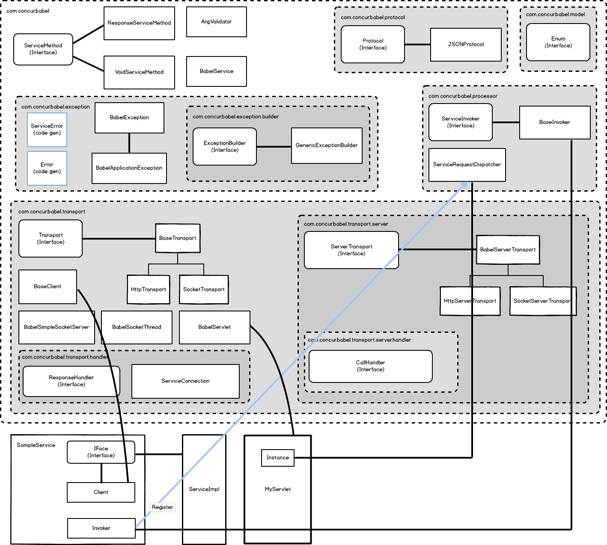

BABEL and Java
==============

Overview
--------

When babel creates a service interface for a given babel idl file the following components are created.

* Models - a class is created for each struct defined in a babel file or included babel file using the struct name and namespace in the babel file.
* Constants - a class is created for each const defined in a babel file or included babel file using the const name and namespace in the babel file.
* Enums - a class is created for each enum defined in a babel file or included babel file using the enum name and namespace in the babel file.
* Service Object - a class is created for each service defined in a babel file or included babel file using the service name and namespace in the babel file.

Usage/Configuration
-------------------

#### ExampleService Example

Through out the this section I will use the notion of a ExampleService when showing how to host a babel service and call it from a java remote client.

First off when babel generates a service definition it creates a class using the name of the service from your babel file, this new service class has 3 parts to it;

    ExampleService
        Iface - the actual interface of your service that any implementation needs to implement.
        Client - the client object that is used when calling your hosted babel service.
        Invoker - the service invoker or more to the point the babel magic class that takes a request and understands how to call a service method implementation.
        
##### Server Setup

See the following links for details on how to setup babel services for a Spring and a non-Spring application.

* [Non-Spring](core/distro/README.md)
* [Spring](spring/distro/README.md)

Once your setup is complete, you can fire up you servlet container and start making call..or fire up your test harness and test your new service that way.

##### Client Calls

To make calls to your new ExampleService from a remote java client you turn again to the ExampleService class generated by babel and start making calls, for example;

    ExampleService.Client client = new ExampleService.Client("http://localhost/babel");
    client.doSomething(1234, true);
    
In this case you simply create a new instance of the Client object on ExpenseService passing it a base url of where you are hosting babel services and call your service method.

The is the simplest example, babel provides a lot of flexibility such as passing header properties using "setHeader" on the client...or even going as far as choosing a different
Transport or Protocol, more advanced details in other sections about Transports and Protocols. By default though babel is making a POST call to the server using JSON on the wire.

##### Standalone Configuration

The java babel libraries is built in a way where the core dispatching and service method invoking is very abstracted away from ways services are hosted, meaning you can host
services outside of just the normal way of doing it via http and a servlet.  This might be useful if you want to wedge babel into an existing servlet model or maybe if you
want to host services via a socket server.  At the core of babel is the ServiceRequestDispatcher, this class can be used to register services, exception builder and will
handle request/responses for services, in fact the BabelServlet is just a wrapper around this class.  Here is an example of using this class outside of a servlet, again
hosting our ExampleService.

    ServiceRequestDispatcher dispatcher = new ServiceRequestDispatcher();
    dispatcher.register(new ExampleService.Invoker(new ExampleServiceImpl()));
    
    // You can set default and extra exception builders
    dispatcher.setDefaultExceptionBuilder(new ExampleDefaultExceptionBuilder());
    dispatcher.registerExcaptionBuilder(new MyApplicationExceptionBuilder());
    
    // Dispatch a request
    dispatcher.dispatch(new HttpServerTransport(req, resp));
    
The dispatcher takes a ServerTransport (see Javadoc) which is a wrapper on how requests are getting to your application, currently there is an Http & Socket server transport.

Java Runtime Library
--------------------

Exceptions
=========================================

Babel provide a common standardize way for handling exceptions thrown from service code back to clients.  Errors thrown to clients are handled by babels Transport objects that can serialize an erorr message format into an exception which is thrown on the client side an allows clients to catch or bubble up the exceptions as they would normally in their native language.

Error response come in 2 different flavors;

1. Application Error - errors that are intended to be caught by the client and protentially change their logic or retry something...best use case might be if you try to withdraw funds of 100 dollars but only 50 dollars exist in an account, clients might want to catch a non sufficent funds error and retry using 50 dollars instead.
2. Non Application Error - errors that are usually unexpected and would typically just bubble up to be handled by client code error handling logic. For example some timeout or unexptected error happens when processing a service request.

Within the java library each of these concepts are handled by a typed exception object that will be thrown by babel on the client side;

1. BabelException - "non application errors"
2. BabelApplicationException = "application errors"

BabelException is the base exception and the BabelApplicationException extends it.

Both exception types have a wrapped ServiceError structure that is available to the client that provides a lot of flexiblity for informing clients of what went wrong. The following is sudo code of that structure;

    ServiceError
        Date time - The date time of the error on the service side.
        List<String> errors - a list of error objects..see below for detals, typically one exception translates to one Error, but custom configuration may change this.
        Map<String,String> tags - any tags related to the error, for example maybe you want to provide categorized tags from a certain area of the service layer.
        String details - details of the overall error, in most cases this would be the stacktrace from the service layer, the java library allows this to be filtered via a configuration.
        ServiceError inner - reserved for cases where a babel clients might be within a babel service calling other babel services.
    Error
       String code - an error code provided to the client.
       String message - an error message provided to the client, typically in US-English.
       List<String> params - any supporting parameters to the message, for example a validation message might provide parameters stating a range is between 4 & 55.

Exception Configuration
-----------------------

Babel's java library allows users to register exception mappings with the ServiceProcessManager. Again this mapping allows developers to map their existing exception hierarchy with babel to translate them into babel exceptions, again either a BabelException or BabelApplicationException.  This is done by providing a implementation of an ExceptionBuilder interface, see below for the simple interface or more details in the javadoc for babel;

    public interface ExceptionBuilder {
        BabelException buildException(Throwable exception, Map<String,String> requestContext, ServerTransport serverTransport);
    }

Out of the box babel provides a default exception builder on the ServiceProcessManager via the GenericExceptionBuilder which will result in a non application error to the client using an erorr code of "9999" and general information provided on exception bubbling up to the babel framework.  The default exception builder can be overridden on the ServiceRequestDispatcher;

    ServiceProcessManager.setDefaultExceptionBuilder(ExceptionBuilder builder);

Using the ExceptionBuilder framework you can configure babel to handle any array of conditions that might be thrown from your service code, here are a couple use cases;

* ApplicationException Hierarcy

Let's say your application provides an exception object called ApplicationException that provides error codes and various other things specific to your application.  This exception can be used directly or extended for common errors.  In this case you can implement an ExceptionBuilder to catch these type of excaptions and use the specific information on the excaption to turn them into a BabelException, be it application or non application, likely application in this use case.  Then you can register your exception builder with babel.

    ServiceProcessManager.registerExceptionBuilder(ApplicationException.class, new ApplicationExceptionBuilder())

* Authorization Exceptions

Let's say your service layer provides a way to check calling users against required roles..and if a required role is not available then it throws an AuthorizationException with specific information including the required roles for a certain service method call.  Again similar to the use case from above you can implement an ExceptionBuilder to handle these types of exceptions and translate the specific exception information into a babel exception, in this case likely a non application error.

    ServiceProcessManager.registerExceptionBuilder(AuthorizationException.class, new AuthorizationExceptionBuilder())

* Quick Exception Mapping

If you want to just quickly map an exception type to a certain error code and message without creating a new ExceptionBuilder then you can use an exception builder provided by babel, see javadocs on the GenericExceptionBuilder, this allows for simple and quick mapping like this;

    ServiceProcessManager.registerExceptionBuilder(MyException.class, new GenericExceptionBuilder("898989", "My Error Message"))

**Note:*** When babel looks for an ExceptionBuilder to use for a thrown exception it will walk the exception hierarchy tree until it finds a direct mapping to the exception class or any parent class of the exception that has a registered ExceptionBuilder.  If no ExceptionBuilder is found then the default on the ServiceProcessManager will be used.

Logging Hooks
=========================================

Babel provides hooks to perform logging on both the client and service sides.  This allows clients and service developers to perform custom logging logic.

There are two 'handler' interfaces:

1.  ResponseHandler - can be implemented on the client side to invoke logic when the client receives the response from the remote service call
2.  CallHandler - can be implemented on the server side to invoke logic once the service method returns

Both handlers expose an onSuccess API to handle a successful request/call, and an onFailure API to handle a failed request/call

##### Implementing a Client Hook

To add a logging hook to a babel client, provide an implementation to the ResponseHandler interface:

    public interface ResponseHandler {

        void onSuccess(
            ServiceConnection serviceConnection, 
            Map<String, String> headers, 
            String request, 
            String response, 
            long duration);
        
        void onFailure(
            ServiceConnection serviceConnection, 
            Map<String, String> headers, 
            String request, 
            String response, 
            long duration, 
            Integer errorCode, 
            Exception exception);
    
    }

You can implement a ResponseHandler to dump information into BigData, and log errors to an ErrorService:
    
    public class ExampleResponseHandler implements ResponseHandler {

        public void onSuccess(...) {
            dumpToBigData(...);
        }
        public void onFailure(...) {
            dumpToBigData(...);
            logToErrorServices(...);
        }

    }

You can add one or more ResponseHandler objects to your client, or the clients transport:

    ExampleService.Client client = new ExampleService.Client("http://localhost/babel");
    client.addResponseHandler(new ExampleResponseHandler());
    client.doSomething(1234, true);

Values passed to the handler methods are as follows:

    ServiceConnection - an object containing the connection information about the remote babel hosted service call, including:
        host - the Host of the service of the babel hosted service
        port - the port of the babel hosted service
        service name - the name of the service
        service method - the name of the service method
    request - the request message body that was sent across the wire in the service call
    headers - the request headers that were sent with the request across the wire in the service call
    response - the reponse message body that was returned across the wire from the service call
    duration - the number of milliseconds the remote service call took to complete
    errorCode (onFailure only) - the response code associated with the failure
    exception (onFailure only) - the exception that caused the failure

##### Implementing a Service Hook

To add a logging hook to a babel hosted service, provide an implementation to the CallHandler interface:

    public interface CallHandler {

        void onSuccess(
            ServerTransport transport,  
            long duration);

        void onFailure(
            ServerTransport transport,  
            long duration, 
            Integer errorCode, 
            Exception exception);

    }

You can implement a CallHandler to dump information into BigData, and log errors to an ErrorService:
    
    public class ExampleCallHandler implements CallHandler {

        public void onSuccess(...) {
            dumpToBigData(...);
        }
        public void onFailure(...) {
            dumpToBigData(...);
            logToErrorServices(...);
        }

    }

You can add one or more CallHandler objects to your ServiceRequestDispatcher:

    ServiceRequestDispatcher dispatcher = new ServiceRequestDispatcher();
    dispatcher.addCallHandler(new ExampleCallHandler());

Values passed to the handler methods are as follows:

    ServerTransport - an interface that provides access to server transport data such as:
        remoteIpAddress - the Ip address of the remote caller
        localHostName - the name of the host of the service
        localIpAddress - the ip address of the host of the service
        port - the port of the host of the service
        serviceName - the name of the service
        methodName - the name of the service method
        message - the request message body that was sent across the wire in the service call
        headers - the request headers that were sent with the request across the wire in the service call
        responseMessage - the reponse message body that was returned across the wire from the service call
        responseCode - the response code that the service call returned
    duration - the number of milliseconds the remote service call took to complete
    errorCode (onFailure only) - the response code associated with the failure
    exception (onFailure only) - the exception that caused the failure

Client Retry
=========================================

Babel clients support simple retry configuration that includes a maximum number of retries and a retry delay in ms.
This is provided so that clients can be configured to make multiple attempts at calling a babel hosted service when <b>transient</b> type exceptions arise.  This would include when a connection to the remote service cannot be established, and when a connection time out occurs.  

This can be set directly on a client:

    ExampleService.Client client = new ExampleService.Client("http://localhost/babel");
    client.setMaxRetries(3);
    client.setRetryDelay(1000);
    client.doSomething(1234, true);

All configured client ResponseHandler's will be called for each failed attempt.

